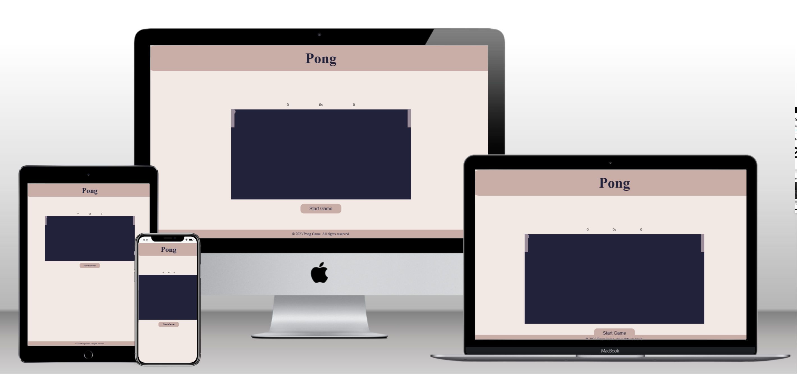
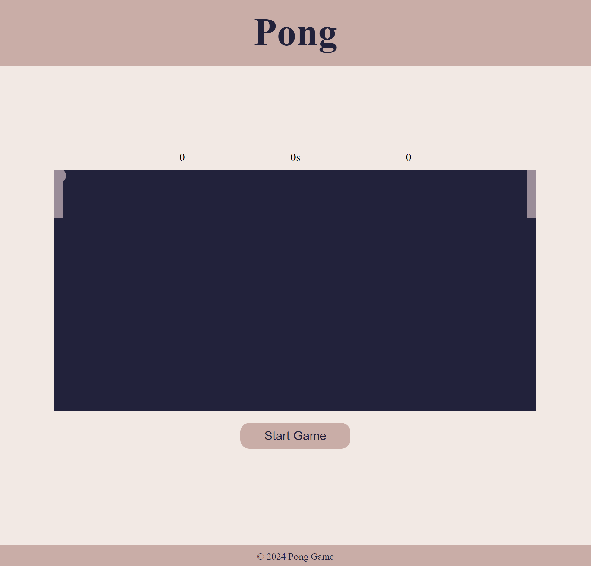
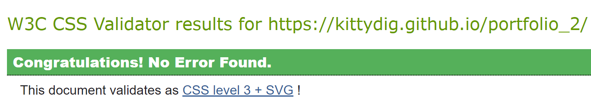
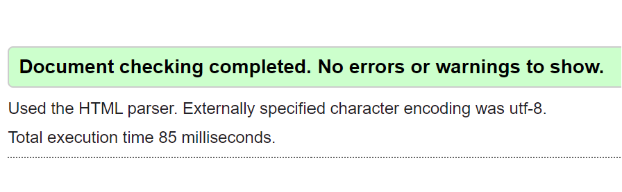
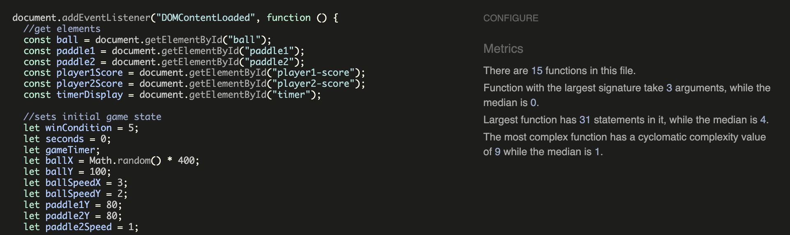
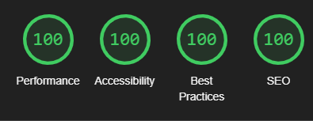

# Pong Game

[Link to live project](https://kittydig.github.io/portfolio_2/)
## Table of Contents
1. [User Experience](#user-experience)
   - [User Stories](#user-stories)
   - [Installation](#installation)
2. [Design](#design)
   - [Colors](#colors)
   - [Design Inspiration](#design-inspiration)
3. [Features](#features)
   - [Homepage](#homepage)
   - [Footer](#footer)
   - [Gameplay](#gameplay)
   - [Modal](#modal)
   - [Start Button](#start-button)
4. [Technologies Used](#technologies-used)
5. [Testing](#testing)
   - [User Testing](#user-testing)
   - [Validator](#validator)
   - [Lighthouse](#lighthouse)
   - [Accessibility](#accessibility)
6. [Bugs/Issues](#bugsissues)
   - [Fixed](#fixed)
   - [Unfixed](#unfixed)
7. [Deployment](#deployment)
8. [Credits](#credits)
   - [Design](#design-credits)
   - [JavaScript](#javascript-credits)
9. [Acknowledgements](#acknowledgements)

## User Experience

### User Stories

- As a player, I want to be able to play the Pong game on various devices, including mobile, tablet, and desktop, to ensure a seamless gaming experience.
- The game plays slightly different on mobile or tablet as the user has to tap where they want to paddle, but this is just as playable as the PC version.
- I wanted this game to be playable by a wide variety of audiences, from people with no gaming experience to people who play a lot of video games.
- I achieved this by making a very easy to understand game with a very basic learning curve.

## Installation

1. Clone the repository.
2. Open the `index.html` file in your web browser.

## Design

### Colors

- Background: #f2e9e4
- Score Container: #22223b
- Ball: #9a8c98
- Paddles: #9a8c98
- Modal Background: #c9ada7
- Start Button: #c9ada7 (Normal), #9a8c98 (Hover)

### Design Inspiration

- I aimed for a modern and unique design for the Pong game, and I found inspiration for the color palette on [coolors.co](https://coolors.co/).

## Features

### Homepage

- The homepage is the only page of the website, it features the header, game arena, paddles, ball, start button and footer.

### Footer

- The footer is basic, with the game name and year.

### Gameplay

- The game includes a pong game interface with paddles, a ball, and a scoring system.
- The paddles are controlled by the users mouse in the PC version, and by tapping the screen on the tablet and mobile version.
- The right paddle is computer operated, following the ball, rather than being a generic up and down defence system, which makes the game slightly more difficult.
- The game gets increasingly difficult for the player if they score a point by speeding up the ball and the right paddle, the game difficulty does not change if the computer scores a point.

### Modal

- A modal is displayed at the end of the game to announce the game result, this gives the player a sense of achievement if they win, or a drive to do better if they lose.

### Start Button

- A button to initiate the game so the user does not get immediately faced with a running game.
- This button can also be used to restart a game during a match.

## Technologies Used

- HTML
- CSS
- JavaScript

## Testing

### User Testing

- Conducted user testing with my cousin, who played the game on an iPad. The game was successfully played on mobile, tablet, and desktop, ensuring a versatile user experience.
- She enjoyed the game and found it to not be too difficult, but it had enough challenge for her to play a few rounds of the game.

### Validator

- HTML: [W3C HTML Validator](https://validator.w3.org/)
- CSS: [W3C CSS Validator](https://jigsaw.w3.org/css-validator/)
- JS: [JSHint](https://jshint.com/)
- The code passed all of these scans with no errors or offers of improvement.

### Lighthouse

- Conducted Lighthouse audits for performance, accessibility, SEO, and best practices and I got at least 95 in all areas.

### Accessibility

- Ensured the game is accessible on various devices and passed accessibility checks using tools like [Accessibility Checker](https://www.accessibilitychecker.org/).
- This tool found no critical issues.

## Bugs/Issues

### Fixed

- I dealt with quite a few bugs during this process, mainly to do with collision and the size of the arena. When the arena was resized, it would hit an invisible line in the middle of the arena.
- I began the project with an arena size of 400px x 200px, this led to great difficulty when readjusting for a larger arena as there was a line of code I kept overlooking 'if (ballX < 0 || ballX + ball.clientWidth > 800)'. When I realised this line was causing the issues, it was a great relief and this bug was fixed.

### Unfixed

-There is a bug that can occur if the ball hits the paddle at a very certain angle. The ball jitters along the paddle then bounces off the paddle. I did not have enough time to delve further into this bug so it has not yet been fixed but I would like to spend more time on this project and find out how to fix this.

## Deployment

- Deployed the game to github pages, https://kittydig.github.io/portfolio_2/

## Credits

### Design

- Color Palette: [Coolors](https://coolors.co/)
- Favicon: [Favicon.io](https://favicon.io/)

### JavaScript

- [GeeksforGeeks](https://www.geeksforgeeks.org/pong-game-in-javascript/): Provided examples for using pong game logic.
- [Gist by straker](https://gist.github.com/straker/81b59eecf70da93af396f963596dfdc5): Offered assistance and code snippets for JavaScript.
- [CodePen by gdube](https://codepen.io/gdube/pen/JybxxZ): Provided additional JavaScript help.
- [JavaScript Plain English](https://javascript.plainenglish.io/js-tutorial-create-a-ping-pong-game-bc92c9f3011a): Tutorial used for creating the pong game in JavaScript.
- [Medium Tutorial](https://medium.com/@muzammal3150/creation-of-ping-pong-game-in-javascript-with-explanation-57a783d8400): Tutorial for creating a pong game with explanations.
- [Stackexchange](https://codereview.stackexchange.com/questions/172604/classing-pong-game): Question on how to improve pong game.

## Acknowledgements

-Thank you to my mentor Spencer for all of the guidance and help with this project!